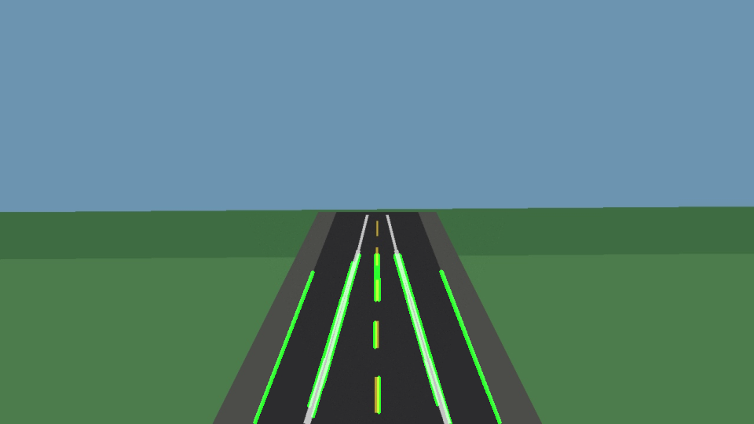
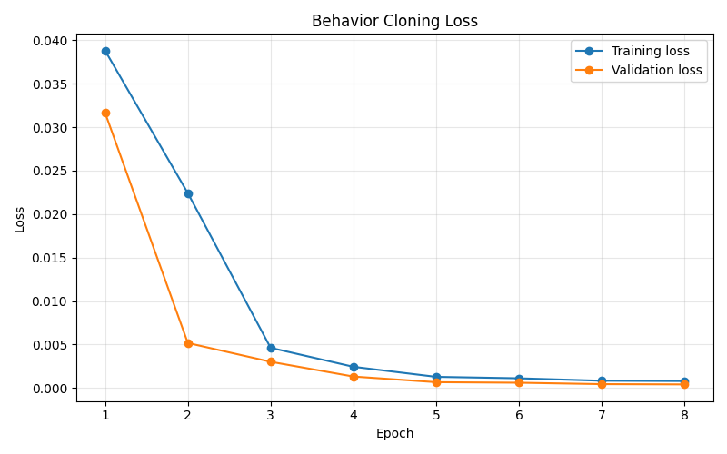

# DarkDrive AI Simulation

A simulation-based autonomous driving AI project focused on computer vision, data collection, lane detection, and behavior cloning.

## Safety Notice

This project does not control a real vehicle. It is developed only for simulation, education, and portfolio purposes.
No public road testing, real vehicle control, or unsafe deployment is part of this repository.

## Project Goals

- Learn autonomous driving basics in simulation
- Collect driving data
- Process camera frames
- Build a lane detection prototype
- Train a simple steering prediction model
- Evaluate model behavior in simulation

## Tech Stack

- Python
- OpenCV
- NumPy
- Pandas
- Matplotlib
- PyTorch
- Jupyter
- Optional later: DonkeyCar simulator integration
- Optional later: CARLA Python API

## Folder Structure

```text
darkdrive-ai-simulation/
|-- README.md
|-- requirements.txt
|-- .gitignore
|-- docs/
|   |-- roadmap.md
|   |-- devlog.md
|   |-- safety-notes.md
|   |-- model-notes.md
|   |-- dataset-format.md
|   |-- data-collection-plan.md
|   |-- simulator-setup.md
|   |-- udacity-simulator-notes.md
|   |-- simulation-roadmap.md
|   `-- reels-plan.md
|-- simulator/
|   |-- donkeycar/
|   |   `-- README.md
|   `-- carla/
|       `-- README.md
|-- data/
|   |-- raw/
|   |-- processed/
|   `-- samples/
|-- src/
|   |-- data_collection/
|   |-- lane_detection/
|   |-- models/
|   |-- training/
|   |-- inference/
|   `-- simulator/
|-- notebooks/
|-- models/
|-- screenshots/
`-- videos/
```

## First Demo: Lane Detection with Sample Road Image

The first working demo runs a simple OpenCV lane detection pipeline on the included sample image. This is a computer vision experiment only and does not control any real vehicle.

The default demo input is:

```text
data/samples/road_sample.jpg
```

`road_sample.jpg` is only a demo/test image for computer vision experiments. It exists so the lane detection script can produce a visible output quickly in a simulation-focused portfolio workflow.

### Windows PowerShell Setup

Create a virtual environment:

```powershell
python -m venv .venv
```

Activate the virtual environment:

```powershell
.\.venv\Scripts\activate
```

Install project requirements:

```powershell
pip install -r requirements.txt
```

Run the lane detection demo:

```powershell
python src/lane_detection/basic_lane_detection.py --image data/samples/road_sample.jpg --output screenshots/lane_detection_result.png
```

If the input image is found and OpenCV can process it, the output image will be saved to:

```text
screenshots/lane_detection_result.png
```

## Web Lane Demo Images

Additional road and lane images downloaded from open web sources are stored in:

```text
data/samples/web_lane_images/
```

Small hand-picked files:

```text
data/samples/web_lane_images/andre_branco_unsplash_road.jpg
data/samples/web_lane_images/approaching_morrisons_roundabout.jpg
data/samples/web_lane_images/bike_lane_painted_buffer.jpg
data/samples/web_lane_images/SOURCES.md
```

These images are for OpenCV lane detection experiments only. They do not include steering labels, throttle, brake, or speed values, so they are not suitable for behavior cloning training.

Example lane detection test with a web image:

```powershell
python src/lane_detection/basic_lane_detection.py --image data/samples/web_lane_images/andre_branco_unsplash_road.jpg --output screenshots/lane_detection_web_result.png
```

Source and license notes are listed in:

```text
data/samples/web_lane_images/SOURCES.md
```

## 500-Image Web Lane Batch

The repository also includes a larger open-license web image batch for lane detection experiments:

```text
data/samples/web_lane_images/wikimedia_batch/
```

Current batch status:

```text
Downloaded source images: 500
Total processed web images: 503
Failed processed images: 0
Detected line segments in batch: 76467
```

Source and license metadata for the 500-image batch is tracked in:

```text
data/samples/web_lane_images/wikimedia_batch_manifest.csv
```

The batch processing report is tracked in:

```text
data/samples/web_lane_images/processing_report.csv
```

Processed visual outputs are generated locally in:

```text
screenshots/web_lane_batch/
```

That output folder is ignored by Git because it contains hundreds of generated result images. The source images and CSV reports are tracked.

Download or refresh the 500-image batch:

```powershell
python scripts/download_web_lane_images.py --limit 500 --output-dir data/samples/web_lane_images/wikimedia_batch --manifest data/samples/web_lane_images/wikimedia_batch_manifest.csv --thumb-width 640 --delay 0.6
```

Process all web lane images:

```powershell
python scripts/process_web_lane_images.py --input-dir data/samples/web_lane_images --output-dir screenshots/web_lane_batch --report data/samples/web_lane_images/processing_report.csv --recursive
```

Important: these web images are useful for OpenCV experiments, but they are not driving training data. Behavior cloning still requires simulator frames with steering labels.

See [docs/web-lane-image-dataset.md](docs/web-lane-image-dataset.md) for details about the 500-image batch.

## How to Install

From Windows PowerShell:

```powershell
cd C:\Users\tarik\OneDrive\Ekler\Desktop\darkdrive-ai-simulation
python -m venv .venv
.\.venv\Scripts\activate
python -m pip install -r requirements.txt
```

Run the basic test helper:

```powershell
python scripts/run_basic_tests.py
```

The helper checks the included sample files, runs lane detection, runs one baseline training epoch, and runs steering prediction. It does not require `pytest`.

## First Working Pipeline

The first local pipeline has been tested end to end with the included demo image, a sample driving log, and a baseline PyTorch steering model.

This is only a baseline test pipeline. The current model is not a real driving model yet, and it must not be used for real vehicle control. Real learning will require simulated driving data collected across different tracks, turns, speeds, and recovery situations.

The tested commands are:

```powershell
python src/lane_detection/basic_lane_detection.py --image data/samples/road_sample.jpg --output screenshots/lane_detection_result.png
python src/training/train_behavior_cloning.py --csv data/samples/sample_driving_log.csv --format simple --epochs 1 --batch-size 1 --output models/steering_model_v1.pt
python src/inference/predict_steering.py --model models/steering_model_v1.pt --image data/samples/road_sample.jpg
```

## How to Run Lane Detection

This command uses the included test image and writes the visual result to `screenshots/lane_detection_result.png`.



```powershell
python src/lane_detection/basic_lane_detection.py --image data/samples/road_sample.jpg --output screenshots/lane_detection_result.png
```

Expected output example:

```text
Loaded image: data\samples\road_sample.jpg
Processing size: 960x540
Detected 13 lane-like line segment(s).
Success: lane detection result saved to screenshots\lane_detection_result.png
```

## How to Test Baseline Training

The sample CSV is only for pipeline testing. It repeats the same demo image and is not enough for real model learning.

```powershell
python src/training/train_behavior_cloning.py --csv data/samples/sample_driving_log.csv --format simple --epochs 1 --batch-size 1 --output models/steering_model_v1.pt
```

Expected output example:

```text
Simulation-only training mode.
Dataset format: simple
Training rows: 2
Validation rows: 1
Device: cuda
Augmentation: on
Starting behavior cloning training...
Epoch 1/1 - training loss: 0.037552 - validation loss: 0.003665 - training MAE: 0.1422 - validation MAE: 0.0605
Model checkpoint saved to models\steering_model_v1.pt
Training loss chart saved to screenshots\training_loss.png
```

`models/steering_model_v1.pt` is generated locally and ignored by Git.

## How to Test Steering Prediction

Run this after the baseline training command has created a local model file:

```powershell
python src/inference/predict_steering.py --model models/steering_model_v1.pt --image data/samples/road_sample.jpg
```

Expected output example:

```text
Loaded simulation-only steering checkpoint.
Predicted steering angle: 0.0605
```

## AI Training Direction: Behavior Cloning

DarkDrive AI Simulation is evolving toward a baseline behavior cloning workflow for simulated driving data.

- The model learns from simulated driving data.
- Input: front camera image.
- Output: one continuous steering angle.
- Training data format: `image_path, steering, throttle, brake, speed`.
- Evaluation stays inside simulation.
- This is not real vehicle control.
- This is a portfolio and education project.

The first AI model is a small PyTorch CNN. It is intentionally simple so the data flow is easy to understand before adding larger datasets, better preprocessing, or simulator integration.

## How to Run AI Skeleton

The training script expects a simulated driving log at:

```text
data/processed/driving_log.csv
```

The CSV should use this format:

```text
image_path,steering,throttle,brake,speed
data/samples/road_sample.jpg,0.0,0.3,0.0,10.0
```

`data/samples/sample_driving_log.csv` is included only to demonstrate the expected format. It is not real training data.

Run the training skeleton:

```powershell
python src/training/train_behavior_cloning.py --csv data/processed/driving_log.csv --format simple --epochs 5 --batch-size 32 --output models/steering_model_v1.pt
```

Run single-image inference after a model has been trained:

```powershell
python src/inference/predict_steering.py --model models/steering_model_v1.pt --image data/samples/road_sample.jpg
```

Trained `.pt` and `.pth` model files are ignored by Git so large experiment artifacts do not get committed by accident.

## Synthetic Steering Training Demo

The 500 web lane images are useful for OpenCV lane detection, but they do not have steering labels. To improve and test the steering model before real simulator data is collected, the project includes a simulation-only synthetic steering dataset generator.

Generate a local synthetic dataset:

```powershell
python scripts/create_synthetic_steering_dataset.py --output-dir data/processed/synthetic_steering --samples 1000 --width 320 --height 160 --seed 42
```

Train the improved steering model:

```powershell
python src/training/train_behavior_cloning.py --csv data/processed/synthetic_steering/driving_log.csv --format simple --epochs 8 --batch-size 64 --output models/steering_model_v2_synthetic.pt --chart-output screenshots/synthetic_training_loss.png --loss huber --augment --device cpu --seed 42
```

Run inference on one synthetic frame:

```powershell
python src/inference/predict_steering.py --model models/steering_model_v2_synthetic.pt --image data/processed/synthetic_steering/IMG/synthetic_00001.jpg
```

Generated synthetic images and model checkpoint files are ignored by Git. The training chart can be tracked as a small visual artifact:

```text
screenshots/synthetic_training_loss.png
```

This synthetic dataset is only for pipeline development. Real model learning still requires simulator driving data with camera frames and steering labels.

Latest local synthetic training run:

```text
Generated frames: 1000
Training rows: 800
Validation rows: 200
Epochs: 8
Final training loss: 0.000789
Final validation loss: 0.000405
Final validation MAE: 0.0208
Example predicted steering: 0.0125
```



## Training with Simulated Driving Data

The sample CSV is only for pipeline testing. Real model learning requires many simulated driving frames collected from a simulator such as DonkeyCar Simulator or CARLA.

Two dataset formats are supported:

- Simple format: `image_path,steering,throttle,brake,speed`
- Udacity-style format: `center,left,right,steering,throttle,brake,speed`

For the Udacity-style format, the current baseline trainer uses only the `center` camera image. Left and right camera images are reserved for future data augmentation work.

Train with the simple format:

```powershell
python src/training/train_behavior_cloning.py --csv data/processed/driving_log.csv --format simple --epochs 5 --batch-size 32 --output models/steering_model_v1.pt
```

Train with the Udacity-style format:

```powershell
python src/training/train_behavior_cloning.py --csv data/processed/driving_log.csv --format udacity --epochs 5 --batch-size 32 --output models/steering_model_v1.pt
```

The training script prints training and validation loss for each epoch and saves a loss chart to:

```text
screenshots/training_loss.png
```

## Phase 2: Simulator Data Collection

The current sample road image and sample CSV were only created for pipeline testing. The project now also supports a real local simulator dataset recorded from the Udacity simulator.

In this phase, the model will learn from simulator camera images and steering values. This remains simulation-only: no real vehicle control, no public road testing, and no unsafe deployment.

Expected simulator data folder:

```text
data/processed/simulator/
|-- IMG/
|   `-- .gitkeep
`-- driving_log.csv
```

Generated simulator images and `driving_log.csv` are ignored by Git because they can become large. The folder placeholders are tracked so the expected structure is visible.

Validate the simulator dataset:

```powershell
python scripts/validate_simulator_dataset.py --csv data/processed/simulator/driving_log.csv --images-dir data/processed/simulator/IMG --format udacity
```

Train with simulator data:

```powershell
python src/training/train_behavior_cloning.py --csv data/processed/simulator/driving_log.csv --images-dir data/processed/simulator/IMG --format udacity --epochs 5 --batch-size 32 --output models/steering_model_v1.pt
```

Predict with a trained model:

```powershell
python src/inference/predict_steering.py --model models/steering_model_v1.pt --image data/processed/simulator/IMG/example.jpg
```

## Using the Local Udacity Simulator

Local simulator folder:

```text
C:\Users\tarik\Downloads\win_sys_int\win_sys_int
```

This simulator folder stays outside the repository. Do not copy or commit `sys_int.exe`, `sys_int_Data`, simulator assets, generated simulator images, generated CSV logs, or trained model files.

Prepare the project output folder:

```powershell
python scripts/prepare_simulator_output.py
```

Expected output folder:

```text
C:\Users\tarik\OneDrive\Ekler\Desktop\darkdrive-ai-simulation\data\processed\simulator
```

If the simulator asks for a recording/output folder, select that folder.

Validate dataset:

```powershell
python scripts/validate_simulator_dataset.py --csv data/processed/simulator/driving_log.csv --images-dir data/processed/simulator/IMG --format udacity
```

Train model:

```powershell
python src/training/train_behavior_cloning.py --csv data/processed/simulator/driving_log.csv --images-dir data/processed/simulator/IMG --format udacity --epochs 5 --batch-size 32 --output models/steering_model_v1.pt
```

Prediction example:

```powershell
python src/inference/predict_steering.py --model models/steering_model_v1.pt --image data/processed/simulator/IMG/example.jpg
```

Important: the local folder name `win_sys_int` and executable `sys_int.exe` suggest this may be the Udacity System Integration simulator, not the behavior cloning training simulator. If it does not create `IMG` frames and `driving_log.csv`, use it only for visual/manual testing and collect behavior cloning data with another simulator later.

## First Real Simulator Dataset

A first real simulator driving dataset has been recorded from the Udacity simulator. This is no longer only sample or synthetic data: it contains simulator camera frames and steering labels.

The generated dataset is local and ignored by Git:

```text
data/processed/simulator/
|-- IMG/
`-- driving_log.csv
```

The current simulator log uses Udacity-style columns:

```text
center,left,right,steering,throttle,brake,speed
```

The project reads only the `center` camera for the first baseline training run. Left and right camera images are available for future augmentation work.

Latest local dataset summary:

```text
Rows: 3706
Center images: 3706 found, 0 missing
Left images: 3706 found, 0 missing
Right images: 3706 found, 0 missing
Steering range: -1.000000 to 1.000000
Steering mean/std: -0.013526 / 0.350406
Speed range: 0.000037 to 30.489510
Speed mean/std: 23.557869 / 9.844598
```

Validate the simulator dataset:

```powershell
python scripts/validate_simulator_dataset.py --csv data/processed/simulator/driving_log.csv --images-dir data/processed/simulator/IMG --format udacity
```

Analyze the driving log and generate small report screenshots:

```powershell
python scripts/analyze_driving_log.py --csv data/processed/simulator/driving_log.csv --images-dir data/processed/simulator/IMG --format udacity
```

Train the baseline model on real simulator data:

```powershell
python src/training/train_behavior_cloning.py --csv data/processed/simulator/driving_log.csv --images-dir data/processed/simulator/IMG --format udacity --epochs 10 --batch-size 32 --output models/steering_model_sim_v1.pt
```

Evaluate the trained model:

```powershell
python scripts/evaluate_steering_model.py --model models/steering_model_sim_v1.pt --csv data/processed/simulator/driving_log.csv --images-dir data/processed/simulator/IMG --format udacity
```

Latest local training result:

```text
Training rows: 2965
Validation rows: 741
Best epoch: 10
Best validation loss: 0.060776
Validation MAE during training: 0.1740
Evaluation MAE: 0.174045
Evaluation RMSE: 0.246529
```

Generated local artifacts:

```text
screenshots/steering_distribution.png
screenshots/speed_distribution.png
screenshots/simulator_sample_frames.png
screenshots/training_loss_sim_v1.png
screenshots/prediction_vs_actual.png
screenshots/prediction_samples.png
```

The trained checkpoint is generated locally and ignored by Git:

```text
models/steering_model_sim_v1.pt
```

This is a first simulator training baseline. It does not mean the model already drives in the simulator. Simulator autonomous driving integration remains future work.

## Udacity Behavioral Cloning Reference

DarkDrive uses the official Udacity Behavioral Cloning project only as an educational reference:

```text
https://github.com/udacity/CarND-Behavioral-Cloning-P3
```

The shared concept is:

```text
camera image -> steering angle
```

Udacity's original project used a Keras model, `model.h5`, and a simulator `drive.py` loop. DarkDrive keeps the same learning idea but uses a PyTorch implementation:

- PyTorch `SteeringModel`
- `.pt` checkpoints
- `src/training/train_behavior_cloning.py`
- `src/inference/predict_steering.py`
- future simulator-only drive loop under `src/simulator/`

The future simulator drive loop is not implemented yet. The current placeholder file documents the planned architecture without sending simulator commands:

```powershell
python src/simulator/udacity_drive_pytorch.py --model models/steering_model_v1.pt
```

DarkDrive does not copy the old Keras code, does not convert the project to Keras, and does not add real vehicle control. Simulator integration will come only after real simulator dataset validation and PyTorch model training.

See:

- [docs/behavioral-cloning-reference.md](docs/behavioral-cloning-reference.md)
- [docs/udacity-to-darkdrive-adaptation-plan.md](docs/udacity-to-darkdrive-adaptation-plan.md)

## Data Collection Plan

The missing piece is no longer just more road or lane images. For behavior cloning, every training image needs a steering label. A useful training row connects a camera frame with `steering`, `throttle`, `brake`, and `speed`.

Lane detection images and steering model data are different:

- Lane detection can use public road/lane image datasets for computer vision experiments.
- Steering prediction needs simulator frames with matching steering angles.

Recommended source order:

1. Try a Udacity Term 1 behavior cloning simulator if available.
2. Use the current `win_sys_int` simulator only if it can export `IMG` frames and `driving_log.csv`.
3. If it cannot export behavior cloning data, move data collection to DonkeyCar Simulator.
4. Use CARLA later for a more professional camera sensor workflow.

Useful references:

- TuSimple benchmark: https://github.com/TuSimple/tusimple-benchmark
- BDD100K dataset information: https://arxiv.org/abs/1805.04687
- DonkeyCar simulator docs: https://docs.donkeycar.com/guide/deep_learning/simulator/
- CARLA docs: https://carla.readthedocs.io/en/latest/

See [docs/data-collection-plan.md](docs/data-collection-plan.md) for the detailed plan.

## Dataset Formats

See [docs/dataset-format.md](docs/dataset-format.md) for the full dataset guide.

Supported formats:

```text
image_path,steering,throttle,brake,speed
center,left,right,steering,throttle,brake,speed
```

For Udacity-style datasets, the current baseline uses only the `center` camera image. Left and right camera images are future work.

## 30-Day Roadmap Summary

- Week 1: Set up the project, connect to DonkeyCar Simulator, collect initial driving data, and build a basic OpenCV lane detection prototype.
- Week 2: Prepare CARLA workspace notes, explore camera sensors, traffic simulation concepts, and driving log formats.
- Week 3: Prepare datasets, define a baseline behavior cloning model, run first training experiments, and test predictions in simulation.
- Week 4: Improve the model, evaluate behavior, polish GitHub documentation, and create a final demo video.

## Current Status

First real simulator training workflow verified:

- OpenCV lane detection works with the sample image.
- Baseline PyTorch behavior cloning training works with the sample CSV.
- Steering prediction inference works after local training.
- Real Udacity simulator dataset validation works.
- Real simulator driving log analysis works.
- Baseline PyTorch training runs on 3706 simulator frames.
- Offline steering model evaluation works on held-out simulator frames.
- Simulator autonomous driving integration is not implemented yet.

## Future Work

- DonkeyCar simulator integration
- CARLA simulator integration
- Lane detection improvements
- Behavior cloning model training
- Model evaluation dashboard

## Next Phase

Improve the real simulator model with better data balance, recovery driving, left/right camera augmentation, and offline evaluation before implementing any simulator-only autonomous drive loop.
