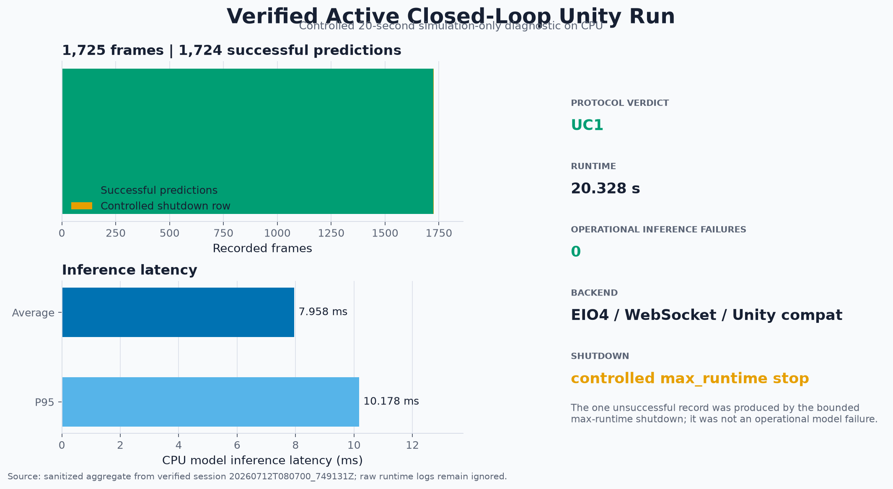
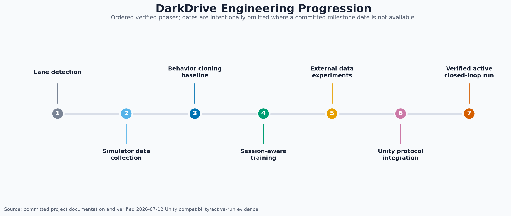
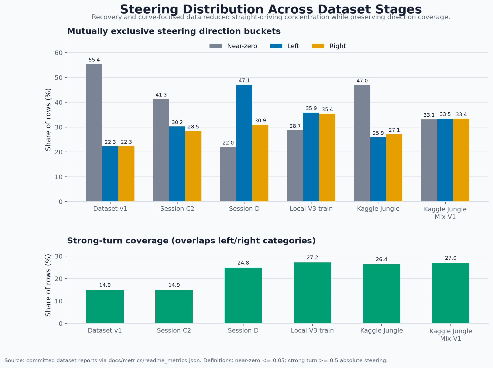
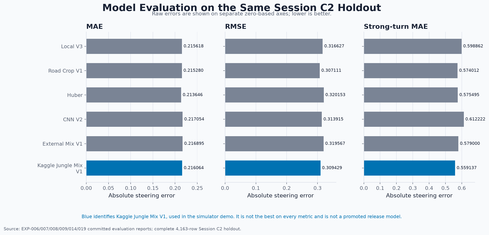

# DarkDrive AI Simulation

[](requirements.txt)
[](https://pytorch.org/)
[](#verified-result)
[](#limitations)
[](#tests)
[](LICENSE)

A simulation-only behavior-cloning research project that trains and evaluates steering models and now includes a verified active closed-loop Unity simulator demo.

DarkDrive began with classical lane-detection experiments, then progressed through simulator data collection, session-aware dataset design, PyTorch steering regression, controlled offline evaluation, protocol debugging, and bounded closed-loop control.

## Verified Result

On 2026-07-12, the current runtime completed a controlled active test in the Unity/Udacity Behavioral Cloning simulator.

| Result | Verified value |
| --- | ---: |
| Active simulator control | **Verified** |
| Runtime | **20.328 s** |
| Recorded frames | **1,725** |
| Successful model predictions | **1,724** |
| Operational inference failures | **0** |
| Average CPU inference latency | **7.958 ms** |
| P95 CPU inference latency | **10.178 ms** |
| Protocol | **EIO4 / WebSocket / Unity compatibility backend** |
| Protocol verdict | **UC1** |
| Shutdown | **Controlled `max_runtime` stop** |



The one unsuccessful record was generated during the controlled max-runtime shutdown. It was not an inference failure during active operation. The runtime sent neutral steering and throttle when the time limit expired.

## Demo Status

> During a controlled 20-second Unity simulator run, the vehicle was observed progressing while following the lane.

That observation is qualitative. The run did not measure lap completion, lane-departure rate, intervention count, collision rate, or repeatability across tracks and seeds.

**This is a Unity simulator demonstration, not a real-vehicle autonomy system.**

A separate verified dry-run processed 6,259 telemetry frames with 6,259 successful predictions, zero failed frames, and a UC1 protocol verdict. Average and P95 inference latency were 14.937 ms and 33.045 ms. All applied control commands remained zero.

## System Architecture


```mermaid
flowchart LR
    subgraph Offline["Offline research path"]
        D["Simulator recordings"] --> V["Dataset validation"]
        V --> M["Session-aware manifests"]
        M --> T["PyTorch training"]
        T --> E["Session C2 evaluation"]
        E --> C["Local checkpoint selection"]
    end

    subgraph Runtime["Closed-loop simulation path"]
        U["Unity center camera"] --> P["EIO4 / WebSocket telemetry"]
        P --> B["Opt-in Unity compatibility backend"]
        B --> I["JPEG decode and preprocessing"]
        I --> N["PyTorch steering CNN"]
        N --> S["Finite check, clipping, EMA smoothing"]
        S --> O["Socket.IO steer / throttle event"]
        O --> U
    end

    C -. "loaded once" .-> N
```

OpenCV lane detection remains a historical perception experiment. It is not part of the current behavior-cloning control loop.

## Engineering Progression



The progression is evidence-driven rather than a product-readiness ladder. Each stage introduced a narrower technical question: image processing, dataset quality, split leakage, model calibration, protocol compatibility, and finally bounded simulator control.

## Dataset Development

DarkDrive separates raw recording sessions from generated manifests and evaluation holdouts. Large images, generated CSV files, and external archives are intentionally excluded from Git.

| Dataset or session | Type / role | Rows | Near-zero | Left | Right | Strong turns |
| --- | --- | ---: | ---: | ---: | ---: | ---: |
| Dataset v1 | Raw historical training source | 3,706 | 55.42% | 22.26% | 22.32% | 14.87% |
| Session A | Raw local training source | 2,400 | 57.42% | 28.17% | 14.42% | 14.12% |
| Session B | Raw local training source | 1,126 | 55.24% | 25.84% | 18.92% | 8.17% |
| Session C2 | Raw validation holdout | 4,163 | 41.32% | 30.22% | 28.47% | 14.89% |
| Session D | Raw curve-focused source | 7,721 | 22.00% | 47.07% | 30.93% | 24.83% |
| Local V3 train | Generated training manifest | 10,657 | 28.72% | 35.86% | 35.41% | 27.20% |
| Kaggle Jungle | External candidate | 3,404 | 47.00% | 25.88% | 27.12% | 26.38% |
| Kaggle Jungle Mix V1 | Generated training manifest | 14,061 | 33.15% | 33.45% | 33.40% | 27.00% |



Near-zero, left, and right are mutually exclusive direction buckets. Strong-turn coverage uses `abs(steering) >= 0.5` and overlaps the left/right categories, so it is plotted separately.

### Dataset strategy

- Dataset v1 established the first real simulator baseline but was 55.42% near-zero.
- Sessions C2 and D added recovery and curve-heavy states.
- Local V3 retained source-session identity, excluded Session C2 from training, and reduced near-zero concentration to 28.72%.
- Local V3 balanced left/right coverage at 35.86% / 35.41%.
- Kaggle Jungle Mix V1 combined all 10,657 Local V3 rows with 3,404 Jungle rows, giving a 24.21% external share.
- Side-camera correction is not part of the main training manifest because no correction magnitude has been validated.

The Kaggle dataset-specific license remains unresolved. External images and archives are not distributed by this repository.

## Model Experiments

The comparison below includes only models evaluated on the same complete 4,163-row Session C2 holdout. Results from other validation sets are not mixed into this table.

| Experiment | MAE | RMSE | Right-turn MAE | Strong-turn MAE | Pred./actual std ratio | Verdict |
| --- | ---: | ---: | ---: | ---: | ---: | --- |
| Local V3 baseline | 0.215618 | 0.316627 | 0.249182 | 0.598862 | 0.656937 | Valid baseline; not promoted |
| Road Crop V1 | 0.215280 | 0.307111 | 0.249969 | 0.574012 | 0.670205 | No meaningful improvement |
| Huber loss | **0.213646** | 0.320153 | 0.276358 | 0.575495 | 0.705915 | No meaningful improvement |
| CNN V2 | 0.217054 | 0.313915 | 0.261968 | 0.612222 | 0.599089 | No improvement |
| External Mix V1 | 0.216895 | 0.319567 | 0.251651 | 0.579000 | 0.700562 | No meaningful improvement |
| Kaggle Jungle Mix V1 | 0.216064 | **0.309429** | **0.242521** | **0.559137** | **0.711011** | Useful offline improvement; not promoted |



Kaggle Jungle Mix V1 did not achieve the best overall MAE. It did improve RMSE, right-turn error, strong-turn error, prediction variance, and direction error relative to Local V3. That tradeoff made it useful for the local simulator diagnostic, not universally superior.

The demo checkpoint is a local research artifact. It is ignored by Git and is not released because model promotion gates and Kaggle licensing remain unresolved.

## Closed-Loop Runtime

### Protocol backends

DarkDrive retains two isolated server paths:

- **Standard backend:** the default standards-compliant `python-socketio` server, which requires a Socket.IO namespace CONNECT packet.
- **Unity compatibility backend:** enabled only with `--unity-compat-mode`; it handles the verified Unity client that sends default-namespace events without first sending CONNECT.

The compatibility parser accepts only the verified callback-level `2["telemetry", ...]` and wire-level `42["telemetry", ...]` forms. Outgoing control remains a Socket.IO EVENT encoded through Engine.IO, producing `42["steer", ...]` on the wire.

### Runtime safety behavior

- The model loads before the server binds.
- Frames are decoded and validated before inference.
- Non-finite predictions are rejected.
- Steering is symmetrically clipped and EMA-smoothed.
- Dry-run forces steering and throttle to zero.
- Corrupt frames and repeated inference failures command neutral control.
- Ctrl+C, `EMERGENCY_STOP`, and max-runtime shutdown paths send neutral control when possible.
- Protocol logs are bounded and redact complete image/base64 payloads.
- Per-frame CSV and session JSON artifacts remain ignored.

The verified active run used CPU inference, throttle `0.05`, maximum steering `0.50`, EMA alpha `0.35`, and a 20-second maximum runtime.

## Quick Start

### 1. Clone and install

```powershell
git clone https://github.com/petrofi/darkdrive-ai-simulation.git
cd darkdrive-ai-simulation
python -m venv .venv
.\.venv\Scripts\Activate.ps1
python -m pip install --upgrade pip
python -m pip install -r requirements.txt -r requirements-simulator.txt
```

The repository has been exercised in local Python 3.10 and 3.12 research environments. Core dependency versions are not fully locked, so use an isolated environment.

### 2. Run the tests

```powershell
python -m unittest discover -s tests
```

### 3. Regenerate README charts

```powershell
python scripts/generate_readme_assets.py
```

### 4. Run a local checkpoint self-test

The checkpoint is not distributed. Supply a locally trained compatible `.pt` file:

```powershell
python scripts/run_closed_loop_simulator.py `
  --checkpoint models/steering_model_kaggle_jungle_mix_v1.pt `
  --device cpu `
  --dry-run `
  --self-test-only `
  --self-test-image data/samples/road_sample.jpg
```

### 5. Connect Unity in dry-run mode

Start the server before entering Autonomous Mode in the Udacity Behavioral Cloning simulator:

```powershell
python scripts/run_closed_loop_simulator.py `
  --checkpoint models/steering_model_kaggle_jungle_mix_v1.pt `
  --host 0.0.0.0 `
  --port 4567 `
  --device cpu `
  --throttle 0.05 `
  --max-steering 0.50 `
  --steering-smoothing 0.35 `
  --dry-run `
  --protocol-debug `
  --unity-compat-mode `
  --max-runtime-seconds 120
```

Accept the connection only after the summary reports telemetry, successful predictions, zero applied controls, and `UC1`.

### 6. Active simulator diagnostic

> **Warning:** simulation only. Complete dry-run acceptance first, supervise the entire test, and keep the run bounded. This command does not authorize real-vehicle use.

```powershell
python scripts/run_closed_loop_simulator.py `
  --checkpoint models/steering_model_kaggle_jungle_mix_v1.pt `
  --host 0.0.0.0 `
  --port 4567 `
  --device cpu `
  --throttle 0.05 `
  --max-steering 0.50 `
  --steering-smoothing 0.35 `
  --unity-compat-mode `
  --max-runtime-seconds 20
```

Emergency-stop file from another PowerShell window:

```powershell
New-Item -ItemType File -Force runtime_logs\closed_loop_v1\EMERGENCY_STOP
```

### Offline evaluation

Evaluation also requires a local checkpoint and the ignored Session C2 manifest:

```powershell
python scripts/evaluate_steering_model.py `
  --model models/steering_model_kaggle_jungle_mix_v1.pt `
  --csv data/processed/local_v3_training/validation.csv `
  --validation-csv data/processed/local_v3_training/validation.csv `
  --format simple `
  --device cpu `
  --preprocessing-profile checkpoint `
  --model-arch checkpoint
```

## Project Structure

```text
darkdrive-ai-simulation/
|-- data/                         # ignored recordings, manifests, and external data
|-- docs/
|   |-- assets/readme/            # generated README charts
|   |-- metrics/                  # sanitized aggregate chart source
|   `-- ...                       # experiment and engineering reports
|-- models/                       # local ignored checkpoints
|-- scripts/
|   |-- generate_readme_assets.py
|   |-- run_closed_loop_simulator.py
|   `-- evaluate_steering_model.py
|-- src/
|   |-- models/                   # steering CNN architectures
|   |-- training/                 # behavior-cloning training
|   |-- inference/                # checkpoint inference
|   |-- simulator/                # guarded closed-loop runtime
|   `-- utils/                    # shared preprocessing
|-- tests/                        # unit and protocol integration tests
|-- requirements.txt
`-- requirements-simulator.txt
```

## Reproducibility

- Training CLIs expose deterministic seeds; controlled experiments use seed `42` unless documented otherwise.
- Local V3 preserves `source_session` and holds the complete Session C2 recording outside training.
- Model comparisons in this README use only the same Session C2 evaluation split.
- Data distributions and model results are stored in [`docs/metrics/readme_metrics.json`](docs/metrics/readme_metrics.json).
- Provenance and comparability rules are documented in [`docs/metrics/README.md`](docs/metrics/README.md).
- README charts are regenerated only from the committed aggregate source.
- Generated datasets, raw images, runtime telemetry, plots outside the README set, and checkpoints remain ignored.
- External archives and Kaggle data are not committed.

The chart generator is deterministic, validates required fields, closes figures, and writes optimized PNG files:

```powershell
python scripts/generate_readme_assets.py
```

A synthetic training-loss graphic is intentionally not used here. The compared experiments do not share one complete committed per-epoch source suitable for a fair combined curve.

## Tests

The current suite contains **141 passing tests** covering:

- preprocessing contracts;
- model architecture and loss configuration;
- session-aware train/evaluation manifests;
- dataset conversion and validation;
- Socket.IO and Engine.IO framing;
- Unity implicit-namespace compatibility;
- dry-run and emergency-stop behavior;
- malformed payload and base64 redaction safeguards.

Reproduce the count from the repository root:

```powershell
python -m unittest discover -s tests
```

## Limitations

- Simulation-only; no physical vehicle control or public-road testing.
- No safety certification or production-readiness claim.
- The active run lasted 20 seconds and is not a completed-lap benchmark.
- Lane-following behavior was observed qualitatively, not scored with lane geometry.
- No intervention, lane-departure, collision, or multi-run stability metric is available yet.
- Session C2 has been reused across experiments and is not a final independent frozen benchmark.
- Session E2 remains uncollected as the intended independent test candidate.
- Model predictions still compress steering variance and under-predict some strong steering magnitudes.
- Side-camera correction is not part of the main training pipeline.
- The model is single-frame; EMA smoothing is a runtime filter, not learned temporal reasoning.
- The demo checkpoint is not committed or promoted.
- Kaggle Jungle licensing remains unresolved.
- Results do not establish real-world autonomy, guaranteed safety, or generalization to other simulators.

## Roadmap

1. Record and publish a clean, clearly labeled simulator demo video.
2. Audit frame-index updates for thread safety under concurrent telemetry callbacks.
3. Collect and freeze an independent Session E2 test recording.
4. Add closed-loop intervention and lane-departure measurement.
5. Run a repeatable multi-run, multi-track simulator protocol.
6. Improve steering calibration, strong-turn response, and recovery behavior.
7. Explore CARLA or DonkeyCar only as separate future research tracks.

## Documentation

### Getting started

- [Simulator setup](docs/simulator-setup.md)
- [Udacity simulator notes](docs/udacity-simulator-notes.md)
- [Dataset format](docs/dataset-format.md)

### Data

- [Dataset collection strategy](docs/dataset-collection-strategy-v1.md)
- [Local V3 dataset build](docs/local-v3-dataset-build-report.md)
- [Session C2 report](docs/dataset-v2-session-c2-right-recovery-report.md)
- [Session D report](docs/dataset-v2-session-d-curve-focused-report.md)
- [Kaggle Jungle Mix V1 build](docs/kaggle-jungle-mix-v1-dataset-build-report.md)

### Training and evaluation

- [Model analysis V1](docs/model-analysis-v1.md)
- [Local V3 evaluation](docs/model-local-v3-evaluation-report.md)
- [Kaggle Jungle Mix V1 evaluation](docs/model-kaggle-jungle-mix-v1-evaluation-report.md)
- [CNN architecture review](docs/cnn-architecture-review-v1.md)

### Closed-loop runtime

- [Closed-loop simulator demo](docs/closed-loop-simulator-demo-v1.md)
- [Safety notes](docs/safety-notes.md)
- [Model release checklist](docs/model-release-checklist.md)

### Research and experiments

- [Experiment ledger](docs/experiments.md)
- [Development log](docs/devlog.md)
- [Research roadmap](docs/research-roadmap.md)
- [External dataset research](docs/external-dataset-research.md)

## License and Author

DarkDrive is released under the [MIT License](LICENSE).

**Tarık Yasin Sağlıcak**<br>
GitHub: [petrofi](https://github.com/petrofi)
